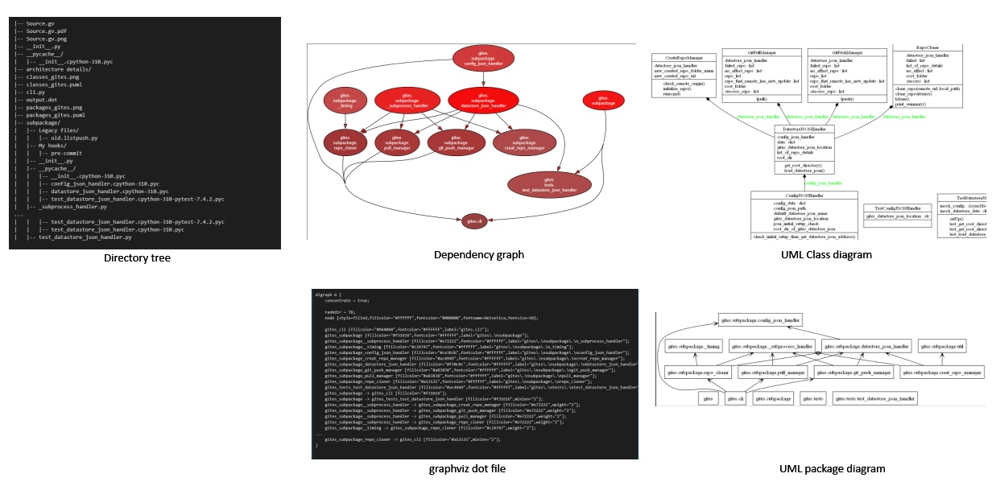
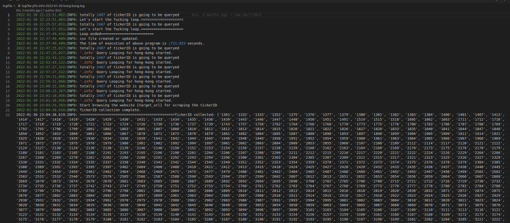
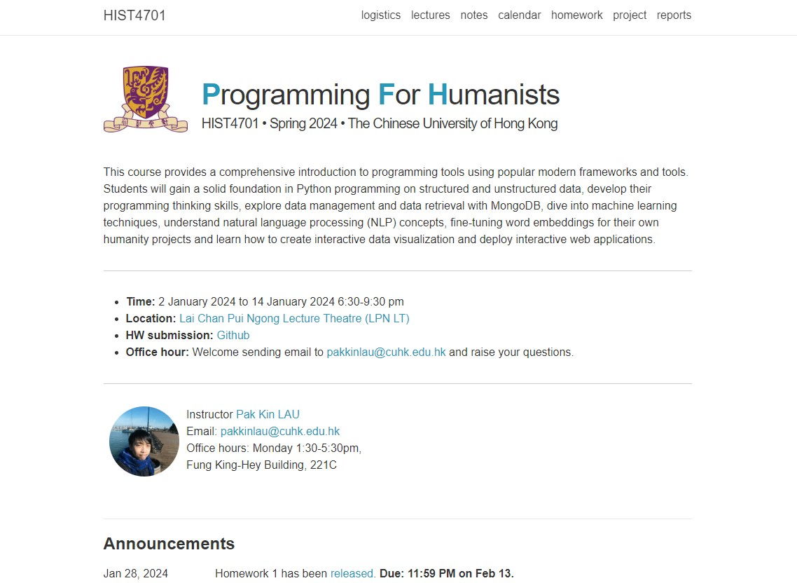

### 👋 Hi there

- I am also an enthusiast deeply involved in creating programming products that bring to life the conceptualization of knowledge schema, knowledge representation, and knowledge modeling.

---

### 📫 Welcome to reach me:

Discord ID: pakkin.lau

---

## 🏘Open Source Packages

The following packages can be discovered and installed directly using PyPI and pip commands.

Workflow optimization

### Status: Deployment Stage 🐲

- [Gites](https://github.com/pakkinlau/gites): The objective of the Gites is to replicate the user experience of employing Google Drive or OneDrive functionalities within the context of Git commands. The actions such as batch push, pull, clone are provided.

---

## 🏘Open Source Programming Projects

While my closed source projects are not listed here, here's a glimpse into the projects I'm currently working on, categorized based on their development stage:

### Status: Deployment Stage 🐲

Software engineering

- [Software Engineering Toolbox](https://github.com/pakkinlau/software_engineering_toolbox): Part 1 is completed. Curate several folders of tools so that user can dignose a target directory easily during software development.

Display:

Bots

- [Keyword-listening-discord-bot](https://github.com/pakkinlau/Keyword-listening-discord-bot): This project represents my personal endeavor to create a Discord bot for my dedicated server. The bot is designed to monitor all messages within a specific Discord server, requiring the specification of a token and guild ID. Whenever it detects predefined commands or keywords in messages, it responds accordingly. In essence, my Discord bot serves as a helpful tool, providing instant access to information from a manual, aiding the coder members of the server with informative responses to their commands.
- [youtube-chatroom-response](https://github.com/pakkinlau/youtube-chatroom-response): An asynchronous youtube chatroom response bot written by python, that allow users to customize the patterns matched in the chatroom, and then automatically response accordingly.

Finance

- [yahoo-finance-scraper](https://github.com/pakkinlau/yahoo-finance-scraper): This python package use the API from yfin package, and collect data from yahoo finance website. Checkout the snapshots in readme.md in this repository for more details.

Display:

- [My tradingview profile](https://www.tradingview.com/u/BillionaireLau/#published-scripts): Check out my contributions to the library of traders community, which garnered over 2000 stars on TradingView.

### Status: Development stage 🌱

Project management

- [csv2gantt](https://github.com/pakkinlau/csv2gantt): Aims to provide a tool that converts csv format data file into gantt chart.

---

## 🏘My Curriculum Development Work

### Status: Deployment Stage 🐲

- [Prog-for-humanists-web](https://pakkinlau.github.io/prog-for-humanists-web/): This collection was created by me and serves as a valuable resource for senior year students at CUHK who are studying humanity major can grow their programming skills in the context of data engineering, database management, machine learning, natural language processing and project deployment as part of a 3-credit course at the university. The course aims to help students to have solid foundation to develop modern and impactful humanity projects in python.

Display: 

### Status: Development stage 🌱

I have discovered a true passion for crafting articles that break down intricate concepts into easily digestible pieces. As a result, I am currently working on developing the following sets of materials for the public. Please remember to cite the source when using these materials.

- [BigdataMath](https://github.com/pakkinlau/BigdataMath): During my learning journey, I've found that I possess the ability to create effective notes that can simplify complex concepts, making them more accessible and comprehensive. Consequently, I'm planning to write a series of articles covering a variety of topics in the field of mathematics related to big data, which is an area I have a strong interest in.

---

## 🏘Open Source Gists

### Status: Deployment Stage 🐲

Software engineering

- [print_dir_tree.py](https://gist.github.com/pakkinlau/fe7ed183e6552999f6fd74aa258802e0): Recursively prints text that contain a tree structure representing the folders and files in a given directory. It  provides insights to LLM or human developer into the structure of a package.

Format change

- [gpt2md.py](https://gist.github.com/pakkinlau/e8f55eb16a6611315d2908b00f226890): A python script that convert the mathematics LaTeX format that you can copy from ChatGPT, into the LaTeX format that markdown (such as Obsidian) can display.

File migration

- [Migrate_to_public_space](https://gist.github.com/pakkinlau/1045344c394f578b1669c66e15abde7a): This Python script facilitates the management of two spaces: a creation space (a large and private area for work) and a publication space (a smaller area for selected items ready for publishing). Users can specify a list of items to migrate from the creation space to the publication space, streamlining the publishing process.

YouTube content download

- [youtube_subtitle](https://gist.github.com/pakkinlau/7383d965316fe43f3d9240e466d3af20): A python script that output youtube video substitle. Only video_id is needed to run the script.
- [downloadYT_whole.py](https://gist.github.com/pakkinlau/fd49ae6fd20fe82f66cc963c08468e78): A python script that download a video without chopping. Only videoID is needed to be provided to run the script.
- [downloadYT_chopping.py](https://gist.github.com/pakkinlau/7acda5a495a76863826cb32562e7aa95): A python script that download a video with chopping. Only videoID is needed to be provided to run the script.

Video editing

- [compress_concate.py](https://gist.github.com/pakkinlau/3963b1081869a0e4ec33db192aa8c0dd): A python script that compress and concatenate a series of videos into a single video.

Scraping

- [JobsDB scraper](https://gist.github.com/pakkinlau/467d0e5a676a8759039d11a0e95f3327): A python script that scrape the job information from JOBSDB, a popular recruiter website in Hong Kong. It also tries to count mentioned skillsets and then make simple statistics for the data collected.

---

### 📚Fields of interest

- Big data analytics and machine learning
- Knowledge modeling and Knowledge base schema design
- Knowledge mining and curation (For personal or multi-user use)

<!--
### Status: Testing stage 🦖
- No packages are under testing stage. 

### Status: Design Stage 🦋
- No packages are under development stage. 

**pakkinlau/pakkinlau** is a ✨ _special_ ✨ repository because its `README.md` (this file) appears on your GitHub profile.

Here are some ideas to get you started:

- 🔭 I’m currently working on ...
- 🌱 I’m currently learning ...
- 👯 I’m looking to collaborate on ...
- 🤔 I’m looking for help with ...
- 💬 Ask me about ...
- 📫 How to reach me: ...
- 😄 Pronouns: ...
- ⚡ Fun fact: ...

---
### 🌱Featured Projects
- elt1
- elt2

---
### 🌱👯 I’m looking to collaborate on 
- [ScrapeEase]: A package that streamline the process of scraping dynamic or static websites.
- elt2

---
### ✨Publications
- elt1
- elt2

-->
