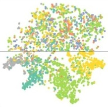
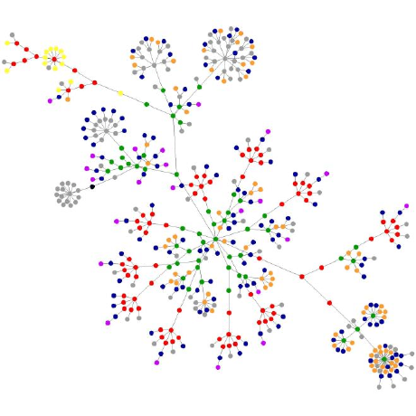

<table>
  <tr>
    <td align="center">
      
      

        <strong>When Dots Dream of Constellations</strong> 
        <em>Each day we shepherd wandering dots into their rightful constellations—defying entropy with algorithms that sculpt order from noise.</em>
      

    </td>
    <td align="center">
      
      

        <strong>Chorus of Scattered Wholes</strong> 
        <em>Dispersed points echo across layers, converging into a single vision—a holistic tapestry woven from distributed fragments.</em>
      

    </td>
  </tr>
</table>
